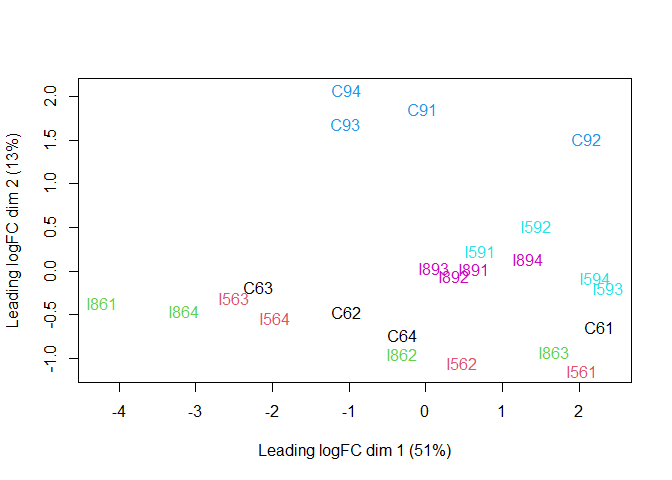
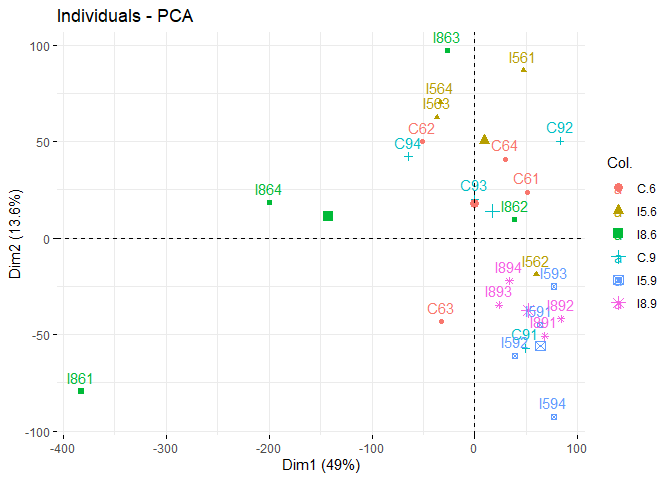
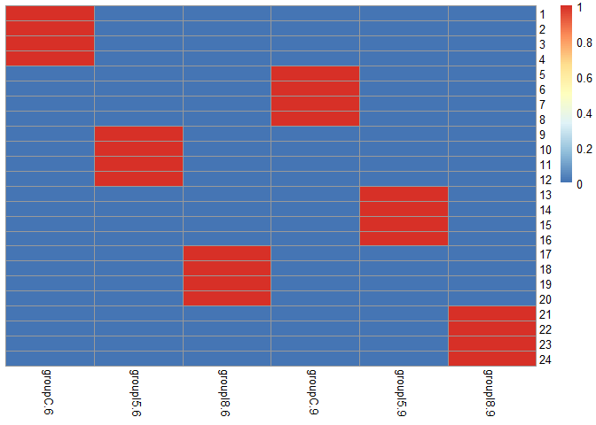
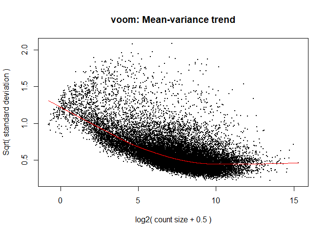
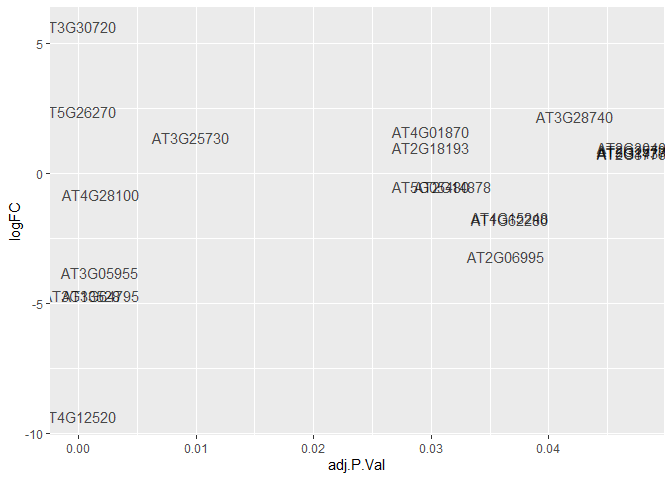

Chapters 1. Data import and understanding of data 2. Data normalization
and making comparison 3. DEGs isolation from groups

In General, the pipeline looks like this Step 1 - DGEList() Step 2 -
model.matrix() Step 3 - voom() Step 4 - lmfit() Step 5 - makeContrasts()
+ Contrasts.fit()

``` r
library(edgeR)
```

    ## Loading required package: limma

    ## Warning: package 'limma' was built under R version 4.1.2

``` r
library(limma)
```

# Chapter 1 Data import and Understanding of Data

``` r
counts <- 
  read.delim("https://raw.githubusercontent.com/ucdavis-bioinformatics-training/2018-June-RNA-Seq-Workshop/master/thursday/all_counts.txt")

head(counts)
```

    ##           C61 C62 C63 C64 C91 C92 C93 C94 I561 I562 I563 I564 I591 I592 I593
    ## AT1G01010 289 317 225 343 325 449 310 299  563  438  380  407  678  386  567
    ## AT1G01020 127  78 142 130 156 146 144  95  138  129   99  118  154  140  127
    ## AT1G03987   0   0   0   0   0   0   0   0    0    0    0    0    0    0    0
    ## AT1G01030  17  25  32  24  22  25  21  35   18    6   46   33   19    8   14
    ## AT1G01040 605 415 506 565 762 854 658 753  704  692  641  601  704  508  733
    ## AT1G03993   1   1   0   0   0   0   1   1    3    0    1    1    1    0    0
    ##           I594 I861 I862 I863 I864 I891 I892 I893 I894
    ## AT1G01010  421  130  411  382  190  501  390  480  407
    ## AT1G01020  154   35  132   97   46  139  175  137  123
    ## AT1G03987    0    0    0    0    0    0    0    0    0
    ## AT1G01030   21   37   16   19   38   24   18   37   23
    ## AT1G01040  614  297  521  542  381  651  573  650  550
    ## AT1G03993    0    0    1    0    1    3    1    1    1

Create DGE object

``` r
d0 <- DGEList(counts)
d0 <- calcNormFactors(d0)
```

Filter data on lower count rate

``` r
cutoff <- 1
drop <- which(apply(cpm(d0),1,max) < cutoff)
d <- d0[-drop,] 
dim(d) # number of genes left
```

    ## [1] 21080    24

set sample names

``` r
snames <- colnames(counts) # Sample names

cultivar <- substr(snames, 1, nchar(snames) - 2) 
time <- substr(snames, nchar(snames) - 1, nchar(snames) - 1)
cultivar
```

    ##  [1] "C"  "C"  "C"  "C"  "C"  "C"  "C"  "C"  "I5" "I5" "I5" "I5" "I5" "I5" "I5"
    ## [16] "I5" "I8" "I8" "I8" "I8" "I8" "I8" "I8" "I8"

``` r
time
```

    ##  [1] "6" "6" "6" "6" "9" "9" "9" "9" "6" "6" "6" "6" "9" "9" "9" "9" "6" "6" "6"
    ## [20] "6" "9" "9" "9" "9"

``` r
group <- interaction(cultivar, time)
group
```

    ##  [1] C.6  C.6  C.6  C.6  C.9  C.9  C.9  C.9  I5.6 I5.6 I5.6 I5.6 I5.9 I5.9 I5.9
    ## [16] I5.9 I8.6 I8.6 I8.6 I8.6 I8.9 I8.9 I8.9 I8.9
    ## Levels: C.6 I5.6 I8.6 C.9 I5.9 I8.9

``` r
plotMDS(d, col = as.numeric(group))
```

<!-- --> -
Checking with PCA -
<https://www.quora.com/Whats-the-difference-between-MDS-and-PCA?share=1>
-
<https://stats.stackexchange.com/questions/14002/whats-the-difference-between-principal-component-analysis-and-multidimensional>

``` r
library(factoextra)
```

    ## Warning: package 'factoextra' was built under R version 4.1.2

    ## Loading required package: ggplot2

    ## Warning: package 'ggplot2' was built under R version 4.1.2

    ## Welcome! Want to learn more? See two factoextra-related books at https://goo.gl/ve3WBa

``` r
library(FactoMineR)
```

    ## Warning: package 'FactoMineR' was built under R version 4.1.2

``` r
pca.raw.d <- log2(d$counts+0.5)

pca.d <- PCA(t(pca.raw.d),graph = F)
fviz_pca_ind(pca.d, col.ind = group)
```

<!-- --> #
Chapter 2 - Data Normalization and making models

-   Voom Transformation and calculation of variance
-   Transform RNA-Seq Data Ready for Linear Modelling

<https://www.montana.edu/rotella/documents/502/DesignMatricesR.pdf>

``` r
library(pheatmap)
```

    ## Warning: package 'pheatmap' was built under R version 4.1.2

``` r
mm <- model.matrix(~ 0 + group)
pheatmap(mm,cluster_rows = FALSE,cluster_cols = FALSE)
```

<!-- -->

``` r
voom.y.d <- voom(d, mm, plot = T)
```

<!-- -->

# fitting data into lm model

``` r
fit <- lmFit(voom.y.d, mm)
coef.fit <- fit$coefficients
head(coef(fit))
```

    ##           groupC.6 groupI5.6 groupI8.6 groupC.9 groupI5.9 groupI8.9
    ## AT1G01010 4.837410 5.3738532  5.065354 5.043214 5.5240004  5.363809
    ## AT1G01020 3.530869 3.4993460  3.212860 3.689622 3.7209961  3.736297
    ## AT1G01030 1.250817 0.9293832  1.559242 1.285596 0.4831707  1.215591
    ## AT1G01040 5.676015 5.9469878  5.778889 6.182374 5.8641107  5.815498
    ## AT1G01050 6.598712 6.5013631  6.463936 6.619239 6.7532886  6.711772
    ## AT1G01060 7.807988 7.4624783  7.390741 8.966047 8.2706387  8.376129

# Chapter 3 - Establish sample group for DEGs analysis

``` r
# An example on how to use make contrast 
x <- c("B-A","C-B","C-A")
makeContrasts(contrasts=x,levels=c("A","B","C"))
```

    ##       Contrasts
    ## Levels B-A C-B C-A
    ##      A  -1   0  -1
    ##      B   1  -1   0
    ##      C   0   1   1

-   Using Contrast and contrast fit

``` r
contr <- makeContrasts(groupI5.9 - groupI5.6, levels = colnames(coef(fit)))
contr
```

    ##            Contrasts
    ## Levels      groupI5.9 - groupI5.6
    ##   groupC.6                      0
    ##   groupI5.6                    -1
    ##   groupI8.6                     0
    ##   groupC.9                      0
    ##   groupI5.9                     1
    ##   groupI8.9                     0

-   toptable(): Extract a table of the top-ranked genes from a linear
    model fit.  
-   eBayes - Empirical Bayes Statistics for Differential Expression

``` r
tmp <- contrasts.fit(fit, contr)
tmp <- eBayes(tmp)
top.table <- topTable(tmp, sort.by = "P", n = Inf)
head(top.table, 5)
```

    ##               logFC  AveExpr         t      P.Value    adj.P.Val        B
    ## AT5G37260  3.048087 6.964609  24.15500 1.193341e-16 2.515563e-12 26.62263
    ## AT3G02990  1.648489 3.304597  13.60533 8.573977e-12 9.036971e-08 16.00622
    ## AT2G29500 -5.034222 5.525802 -12.06212 7.937586e-11 5.577477e-07 14.64565
    ## AT3G24520  1.871574 5.882965  11.71000 1.360008e-10 7.167244e-07 14.38555
    ## AT3G46230 -6.706865 4.544494 -11.18991 3.081581e-10 1.299195e-06 12.51953

``` r
#compared to coef 
coef_DEG <- coef.fit[rownames(coef.fit) %in% rownames(top.table)[1:5],]
coef_DEG[,c(5,2)]
```

    ##           groupI5.9 groupI5.6
    ## AT5G37260  8.505443  5.457357
    ## AT3G02990  4.065733  2.417245
    ## AT3G24520  6.859437  4.987863
    ## AT3G46230  1.100377  7.807242
    ## AT2G29500  3.234275  8.268498

``` r
length(which(top.table$adj.P.Val < 0.05))
```

    ## [1] 4680

``` r
library(dplyr)
```

    ## Warning: package 'dplyr' was built under R version 4.1.2

    ## 
    ## Attaching package: 'dplyr'

    ## The following objects are masked from 'package:stats':
    ## 
    ##     filter, lag

    ## The following objects are masked from 'package:base':
    ## 
    ##     intersect, setdiff, setequal, union

``` r
DEGs <- top.table %>%  arrange(logFC) %>% filter(adj.P.Val <0.05) 
head(DEGs)
```

    ##               logFC    AveExpr          t      P.Value    adj.P.Val          B
    ## AT5G12020 -8.255119 3.02859072  -8.510274 3.366269e-08 3.085259e-05  6.9939311
    ## AT4G10250 -7.950132 1.43459580  -2.937865 7.936987e-03 4.014196e-02 -2.5029126
    ## AT1G53540 -7.184758 4.31696507 -10.160183 1.693866e-09 4.021633e-06 10.8647336
    ## AT3G46230 -6.706865 4.54449435 -11.189910 3.081581e-10 1.299195e-06 12.5195327
    ## AT5G12030 -6.639323 2.99340910  -5.825985 9.275058e-06 9.491176e-04  3.1363087
    ## AT4G25200 -6.303828 0.08513372  -4.151963 4.632203e-04 7.375140e-03 -0.7464764

Export gene list to csv

``` r
top.table$Gene <- rownames(top.table)
top.table <- top.table[,c("Gene", names(top.table)[1:6])]
write.table(top.table, file = "time9_v_time6_I5.txt", row.names = F, sep = "\t", quote = F)
```

# Chpater 3.1 - Change Groupings

``` r
contr <- makeContrasts(groupI5.6 - groupC.6, levels = colnames(coef(fit)))
tmp <- contrasts.fit(fit, contr)
tmp <- eBayes(tmp)
top.table <- topTable(tmp, sort.by = "P", n = Inf)

length(which(top.table$adj.P.Val < 0.05)) # number of DE genes
```

    ## [1] 20

``` r
top.table$Gene <- rownames(top.table)
top.table <- top.table[,c("Gene", names(top.table)[1:6])]
write.table(top.table, file = "I5_v_C_time6.txt", row.names = F, sep = "\t", quote = F)

head(top.table,20)
```

    ##                Gene      logFC    AveExpr          t      P.Value    adj.P.Val
    ## AT4G12520 AT4G12520 -9.3396792  0.5671202 -14.118616 4.276991e-12 9.015898e-08
    ## AT3G30720 AT3G30720  5.6550000  3.5130064  11.628491 1.543229e-10 1.626564e-06
    ## AT5G26270 AT5G26270  2.3722487  4.4417048   9.728356 3.587045e-09 2.520497e-05
    ## AT3G33528 AT3G33528 -4.7012468 -1.6468149  -8.175366 6.441093e-08 3.394456e-04
    ## AT3G05955 AT3G05955 -3.7995906 -1.6958534  -7.210032 4.545141e-07 1.916232e-03
    ## AT4G28100 AT4G28100 -0.8099448  4.5746806  -7.041358 6.477323e-07 1.986777e-03
    ## AT1G64795 AT1G64795 -4.7147903 -1.1051093  -7.032657 6.597456e-07 1.986777e-03
    ## AT3G25730 AT3G25730  1.3872163  3.9538977   6.242201 3.650963e-06 9.620287e-03
    ## AT5G05480 AT5G05480 -0.4869486  4.6067884  -5.647317 1.392471e-05 3.005506e-02
    ## AT2G18193 AT2G18193  1.0100187  3.8571257   5.626785 1.459359e-05 3.005506e-02
    ## AT4G01870 AT4G01870  1.6373400  5.6170176   5.595305 1.568338e-05 3.005506e-02
    ## AT2G14878 AT2G14878 -0.5162040  6.4733722  -5.531829 1.814030e-05 3.186647e-02
    ## AT2G06995 AT2G06995 -3.2115972 -2.3585729  -5.439207 2.244863e-05 3.640132e-02
    ## AT4G15248 AT4G15248 -1.6999189  2.1452779  -5.392221 2.501939e-05 3.673680e-02
    ## AT1G62280 AT1G62280 -1.7551000  2.7349000  -5.373243 2.614099e-05 3.673680e-02
    ## AT3G28740 AT3G28740  2.2032568  5.5413479   5.284877 3.207698e-05 4.226142e-02
    ## AT5G14370 AT5G14370  0.8031693  3.7422520   5.174352 4.147430e-05 4.748115e-02
    ## AT2G25737 AT2G25737  0.8732454  3.6798171   5.163677 4.251876e-05 4.748115e-02
    ## AT2G37760 AT2G37760  0.7703328  5.4139388   5.141986 4.472409e-05 4.748115e-02
    ## AT2G30400 AT2G30400  1.0087276  2.0253964   5.138887 4.504853e-05 4.748115e-02
    ##                     B
    ## AT4G12520  6.42577720
    ## AT3G30720  9.54391447
    ## AT5G26270 11.00209007
    ## AT3G33528  1.56894746
    ## AT3G05955  2.19224634
    ## AT4G28100  6.18609294
    ## AT1G64795  2.33667151
    ## AT3G25730  4.53222502
    ## AT5G05480  3.26213083
    ## AT2G18193  3.23531092
    ## AT4G01870  3.11677860
    ## AT2G14878  2.94274140
    ## AT2G06995  0.02144583
    ## AT4G15248  2.49861111
    ## AT1G62280  2.67518742
    ## AT3G28740  2.42959865
    ## AT5G14370  2.25381821
    ## AT2G25737  2.23281223
    ## AT2G37760  2.08993315
    ## AT2G30400  2.09909628

``` r
p_data <-   top.table %>% filter(adj.P.Val < 0.05) 
  
p_data %>%  ggplot(aes(x=adj.P.Val,y=logFC)) + 
  geom_text(label=rownames(p_data), size=4.0,alpha=0.7) 
```

<!-- -->
